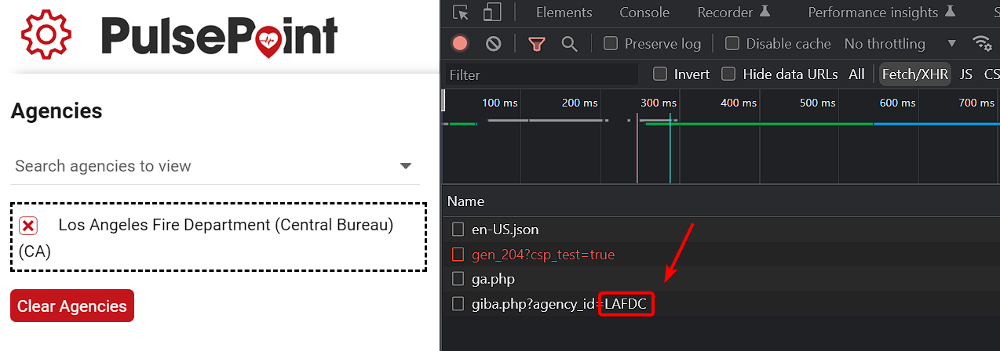

# pulsepoint

[](https://www.npmjs.com/package/pulsepoint)

## About

Open-source Node.js wrapper written in TypeScript for retrieving information from the [PulsePoint](https://web.pulsepoint.org) API. Interprets the encoding used by PulsePoint, simplifies requests to useful data, and converts relevant values to human-readable text.

This is an **unofficial** package and is not affiliated with or supported by PulsePoint in any way.

## Install

Install the module with your package manager of choice:

```
$ npm install pulsepoint

$ yarn add pulsepoint

$ pnpm add pulsepoint
```

## Example Usage

```js
import { getAgencyByLatLng, getAgencyData, getIncidents } from "pulsepoint"

// Get incidents from the LAFD Central Bureau
getIncidents("LAFDC").then((incidents) => {
  // Log the types of active calls
  console.log(incidents.active.map((incident) => incident.type))
})

// Get the agencyKey for the LAFD Central Bureau then retrieve agency data
getAgencyByLatLng([34.075439840119685, -118.21768041631815]).then((agencies) =>
  getAgencyData(agencies[0].agencyKey).then(console.log),
)
```

## API

### Incidents

`getIncidents(agencyIds)` Fetches active and recent incidents for a given agency or array of agencies.

To obtain an agency id:

- Open [PulsePoint Web](https://web.pulsepoint.org) and select the desired agency
- Open the "network" tab of your browser developer tools
- Filter by Fetch/XHR
- Look for a request to /giba.php and copy the agency_id parameter



#### Example Incident Response

```js
{
  "id": "1",
  "agencyId": "LAFDC",
  "type": "Medical Emergency",
  "coordinates": [0.000, 0.000],
  "address": "EXAMPLE LN, CITY, STATE",
  "receivedTime": "2022-01-01T00:00:00Z",
  "clearedTime": "2022-01-01T00:00:00Z",
  "units": [
    {
      "id": "E1",
      "status": "Cleared",
      "clearedTime": "2022-01-01T00:00:00Z",
    }
  ],
  "images": {
    "active": "https://web.pulsepoint.org/assets/images/...",
    "recent": "https://web.pulsepoint.org/assets/images/..."
  }
}
```

`getIncidentTypes()` Returns an array of incident types used by PulsePoint.

---

### Agencies

`getAgencyByLatLng([lat, lng])` Fetches the "key" and name for all agencies covering the given coordinates. Pass an `agencyKey` to `getAgencyData` to retrieve detailed information.

`getAgencyData(agencyKey)` Fetches detailed information about a given agency.

> An `agencyKey` is not the same as the `agencyId` used by `getIncidents`.
